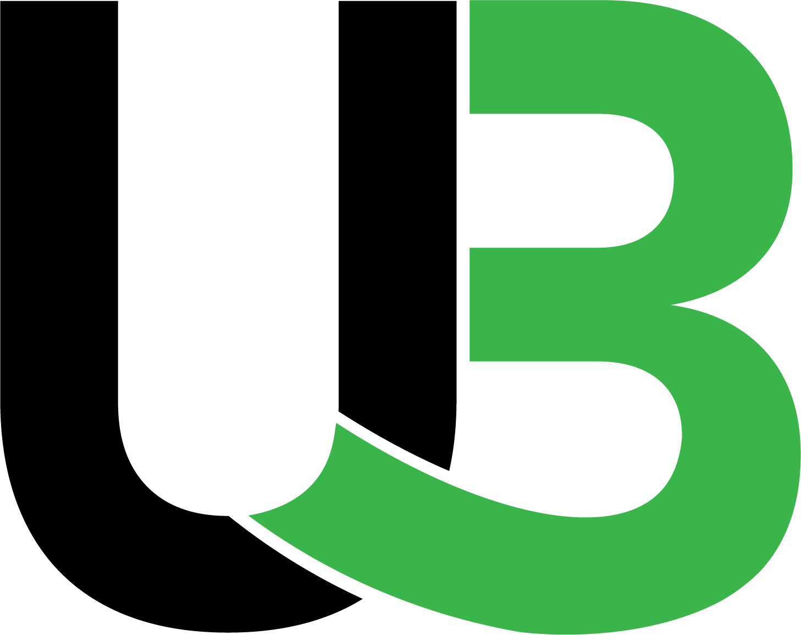

<p align="center">
  <a href="" rel="noopener">
 </a>
</p>

<h3 align="center">UpBit Front End</h3>

<div align="center">

[](https://github.com/jsdcommunity/build_Together_Freelacing-site-for-Developers_FrontEnd)
[](https://github.com/jsdcommunity/build_Together_Freelacing-site-for-Developers_FrontEnd/issues)
[](https://github.com/jsdcommunity/build_Together_Freelacing-site-for-Developers_FrontEnd/pulls)

</div>

---

<p align="center">UpBit | Get it done
    <br> 
</p>

## 📝 Table of Contents

- [About](#about)
- [Getting Started](#getting_started)
- [Built Using](#built_using)
- [Authors](#authors)

## 🧐 About <a name = "about"></a>

UpBit is website for freelancing Developers, you can also create your products with collaborating with developers..!

## 🏁 Getting Started <a name = "getting_started"></a>

These instructions will get you a copy of the project up and running on your local machine for development and testing purposes.

### Prerequisites

What things you need to install the software and how to install them.

1. Git

```
apt install git
```

2. NodeJs

```
apt install nodejs
```

3. NPM

```
apt install npm
```
4. Yarn

```
npm install --global yarn
```

### Installing and running on development mode

A step by step series of examples that tell you how to get a development env running.

Clone this repository to your local system.

```
git clone https://github.com/jsdcommunity/build_Together_Freelacing-site-for-Developers_FrontEnd.git
```

Then go to this project directory by running command `cd build_Together_Freelacing-site-for-Developers_FrontEnd`

Install required packages

```
yarn install
```

Start the react development server

```
yarn start
```

## ⛏️ Built Using <a name = "built_using"></a>

- [React](https://reactjs.org/) - A JavaScript library for building user interfaces
- [Redux](https://redux.js.org/) - A Predictable State Container for JS Apps
- [Material UI](https://mui.com/) - A popular React UI library

## ✍️ Authors <a name = "authors"></a>

- [@Muhammed-Rahif](https://github.com/Muhammed-Rahif) - Contributor
- [@shamilkotta](https://github.com/shamilkotta) - Contributor
- [@ajeeshcp](https://github.com/ajeeshcp) - Contributor
- [@fathimafarhath](https://github.com/fathimafarhath) - Contributor

More details about [contributors here](https://github.com/jsdcommunity/build_Together_Freelacing-site-for-Developers_FrontEnd/contributors).
